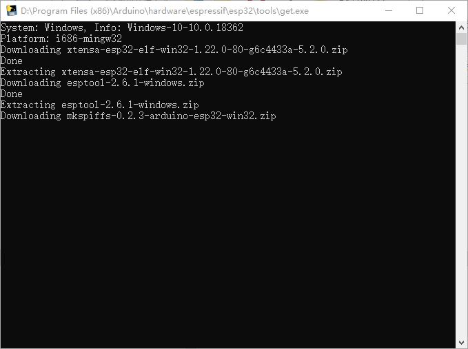

# UNO D1 R32(ESP32)开发环境构筑
## ESP32是啥？

用厂家的话来讲，ESP32 采用 40 nm 工艺制成，具有最佳的功耗性能、射频性能、稳定性、通用性和可靠性，适用于各种应用场景和不同功耗需求。以下是ESP32的主要参数：

| 项目              | 数值                     |
|-------------------|--------------------------|
| 核心数            | 2                        |
| 架构              | 32bit                    |
| Wifi              | Yes                      |
| 蓝牙              | Yes                      |
| 内存              | 512K                     |
| 闪存              | 16M                      |
| GPIO              | 36                       |
| 通讯协议          | SPI, IIC, I2S, UART, CAN |
| ADC（模数转换器） | 18通道12位               |
| DAC（数模转换器） | 2通道8位                 |
| 存储卡接口        | 1                        |
| 温度传感器        | 1                        |

从ESP32的芯片参数可以看出，它的功能非常强大；另外一条也也很重要：它非常便宜。这两个要素决定了：它非常适合目前流行的物联网开发，也非常适合学习嵌入式开发。

## 准备硬件

既然是嵌入式开发，不可避免的会涉及到输入。这里一般有两种方式，选用最简单ESP32开发板，但是这样需要我们自己准备输入输出扩展。虽然算不上有多困难，总是有些麻烦。我们选择另一种方式：遵循Ardino规范的UNO D1 R32开发板：


通过和一元硬币的比较可以知道，UNO D1 R32还是很小的。

## 安装Arduino

[百度百科](https://baike.baidu.com/item/Arduino)中对Arduino的说明如下：

Arduino是一款便捷灵活、方便上手的开源电子原型平台。包含硬件（各种型号的Arduino板）和软件（ArduinoIDE)。由一个欧洲开发团队于2005年冬季开发。其成员包括Massimo Banzi、David Cuartielles、Tom Igoe、Gianluca Martino、David Mellis和Nicholas Zambetti等。
它构建于开放原始码simple I/O介面版，并且具有使用类似Java、C语言的Processing/Wiring开发环境。主要包含两个的部分：硬件部分是可以用来做电路连接的Arduino电路板；另外一个则是Arduino IDE，你的计算机中的程序开发环境。你只要在IDE中编写程序代码，将程序上传到Arduino电路板后，程序便会告诉Arduino电路板要做些什么了。

要做的其实很简单：到以下网页下载并安装ArduinoIDE软件即可

https://www.arduino.cc/en/Main/Software

也可以直接使用以下链接下载。

[Window Installer](https://www.arduino.cc/download_handler.php?f=/arduino-1.8.12-windows.exe)

## 安装ESP32开发包

在ArduinoIDE中安装ESP32有几个方法，最后好用的是参考文档([一波三折](https://www.arduino.cn/thread-91658-1-1.html)那篇)最接近成功，但是下载安装包的过程还是一波三折，主要的问题就是文件下载太困难。
因此作者首先将这些文件收集起来，安装步骤修改如下：

1.Arduino安装下的hardware目录中，创建espressif/esp32目录


2.从github下载[arduino-esp32支持包](https://github.com/espressif/arduino-esp32/archive/master.zip)：


3.将下载得到的Zip文件解压缩到第一步中创建的esp32目录中。

4.进入espressif/esp32/tools目录，执行目录中的get.ext.


5.自动进行安装。但是在第三个文件的时候，一直不能完成。



直接在网上直接检索检索可以找到下面的网页：
https://github.com/igrr/mkspiffs/releases/tag/0.2.3


可以直接选择下载mkspiffs-0.2.3-arduino-esp32-win32.zip或者直接点击下面的链接下载：
https://github.com/igrr/mkspiffs/releases/download/0.2.3/mkspiffs-0.2.3-arduino-esp32-win32.zip

如果还是不能下载，可以使用作者的[备份文件](https://github.com/xueweiguo/EmbeddedCpp/raw/master/Arduino/ESP32/Startup/mkspiffs-0.2.3-arduino-esp32-win32.zip)。

6.进入espressif/esp32/tools/dist目录：


7.将下载的mkspiffs-0.2.3-arduino-esp32-win32.zip拷贝到dist目录并重新执行get.exe。这次会很快结束。

## 选择开发板

启动Arduino进入工具菜单，如下图选择ESP32 Dev Module。


## 动作确认

启动Arduino并输入验证程序：

```
void setup() {
  pinMode(2, OUTPUT);       //设置管脚2为输出模式
}

void loop() {
  digitalWrite(2, HIGH);   // 点亮LED
  delay(500);              // 等待500ms
  digitalWrite(2, LOW);    // 熄灭LED
  delay(500);            // 等待500ms
}
```

使用MicroUSB线连接计算机和UNO D1 R32开发板，并选择端口：


这里有两点需要注意：

1.读者的计算机的端口号可能会有所不同，如果端口号是灰色的需要安装参考信息中的CH340驱动。
2.使用计算机背后的端口。作者使用前面板上的USB端口搞了好半天都无法稳定地下载程序。

上传程序到UNO D1 R32.


也可以使用工具栏中的上传按钮[->]上传程序。

完成后可以看到开发板上的蓝色LED开始闪烁！

   

## 参考信息

[一波三折，分享我的esp32编译环境搭建arduino](https://www.arduino.cn/thread-91658-1-1.html)

[在Arduino IDE上安装ESP32](https://www.yiboard.com/thread-1218-1-1.html)

[Installing the ESP32 Board in Arduino IDE (Windows, Mac OS X, Linux)](https://randomnerdtutorials.com/installing-the-esp32-board-in-arduino-ide-windows-instructions/)

[How to Set Up and Use WeMos TTgo ESP32 Uno D1 R32](https://www.instructables.com/id/How-to-Set-Up-WeMos-TTgo-ESP32-Uno-D1-R32/)

[CH340驱动](http://www.wch.cn/download/CH341SER_EXE.html)

[Arduino中文社区](https://www.arduino.cn/)

[WeMos R1 R32 ESP32](https://www.fambach.net/wemos-d1-r32-esp32/)