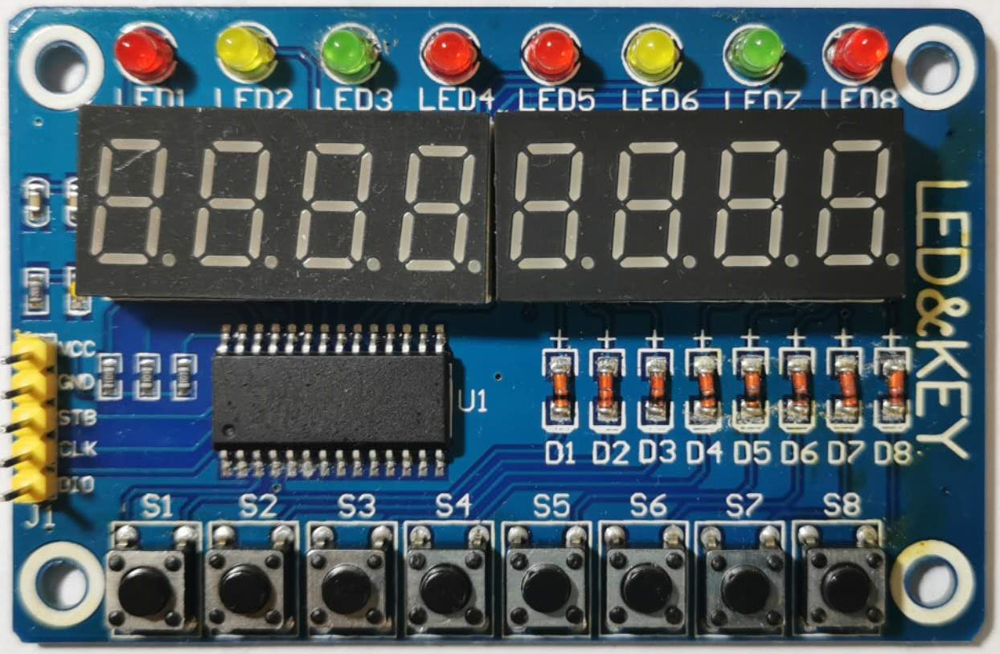
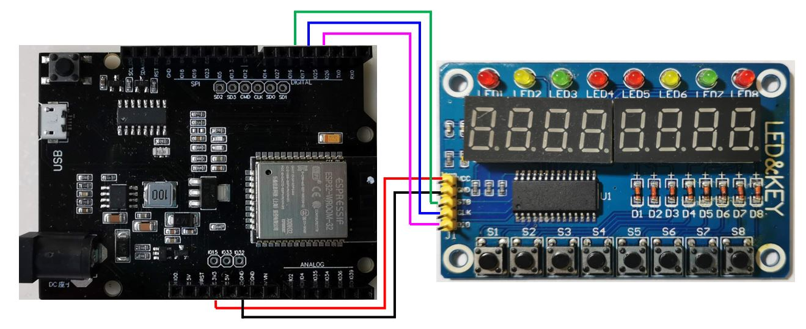

# Arduino环境使用TM1638扩展版

TM1638深圳天微生产的一种带键盘扫描接口的LED（发光二极管显示器）驱动控制专用IC,内部集成有MCU数字接口、数据锁存器、LED驱动、键盘扫描等电路。使用TM1638的显式模块在市场上非常多，价格也很便宜。某宝10元左右就可以买到。例如下面的数码管+LED+按键模块(可以使用TM1638+led+key进行搜索)：

   

本文通过简单示例介绍Arduino环境中使用ESP32开发板驱动TM1638的方法。**其中也包含作者本人踩过的坑，希望可以对读者有些帮助。**

## 连接UNO D1 R32和TM1638扩展板

下图的连法不是必须，只是后续程序的基础，由于拍照角度，文字和端口为止稍微有些偏差，实际的接法以后面的连接表为准。

   

### 连接表
|Arduino D1 R32|TM1638 Led Key Board|
|-------|-----|
|3V3|VCC|
|GND|GND|
|IO16|STB|
|IO17|CLK|
|IO25|DIO|

## 代码说明

首先定义使用的每个引脚。如果读者希望使用其他的引脚，只要代码中的定义和前面的接续方式一致即可。：

```
const int strobe = 16;
const int clk = 17;
const int dio = 25;
```

从上一届中的连接方式也应该可以看出，数据线只有一根，也就是说所有的数据都是以串行方式传送的。第一段代码就是以串行方式写入数据的函数，内容就是从低位开始的移位和输出操作。

```
void writeByte(int value)     //write a byte.
{
  unsigned char i;
  pinMode(dio,OUTPUT);
  for(i=0;i<8;i++)
  {
    digitalWrite(clk,LOW);
    if(value&0X01){
      digitalWrite(dio,HIGH);
    }
    else{
      digitalWrite(dio,LOW);
    }
    value>>=1;
    digitalWrite(clk,HIGH);
  }
  digitalWrite(clk,LOW);
}
```
发送命令的函数就是在发送数据操作的前后有增加了strobe端的控制。
```
void sendCommand(uint8_t value)
{
  digitalWrite(strobe, LOW);
  writeByte(value);
  digitalWrite(strobe, HIGH);
}
```
初始化TM1638。首先发送两个命令：一个是设定数码管和LED的亮度；另一个是设定地址自动增加模式，这样可以简化连续/接受数据时的操作。最后TM1638的所有寄存器。

```
void reset()
{
  sendCommand(0x8b); //set light,0x88-0x8f
  sendCommand(0x40); // set auto increment mode
  digitalWrite(strobe, LOW);
  writeByte(0xc0);   // set starting address to 0
  for(uint8_t i = 0; i < 16; i++)
  {
    writeByte(0x00);
  }
  digitalWrite(strobe, HIGH);
}
```

接下来是数据读入函数，内容是从DIO端口按位接受数据并合成为一个字节。

```
int readByte(void)          //read a byte.
{
  unsigned char i;
  int value=0;;  
  pinMode(dio,INPUT);//set input mode.
  for(i=0;i<8;i++)
  {
    value>>=1;
    digitalWrite(clk,LOW);
    delay(1);                           //if CUP is veryfast.
    if(digitalRead(dio)==HIGH)
      value|=0x80;
    digitalWrite(clk,HIGH);
  }
  digitalWrite(clk,LOW);
  pinMode(dio,OUTPUT);//set output mode.
  return value;
}
```
这里作者遇到了本文开头时提高的那个坑：显示什么的都正常，只是读按钮只能检测到S1到S4，S5到S8无论如何也检测不到。后来经过分析觉得应该是发出clk之后，马上去读数据，由于间隔太短导致一个字节中的后面几位不能正确读出（别问为什么，我真不知道），因此在这个地方增加的一个1ms等待，就所有都OK了。原因可能是CPU太快，也可能是连线状态不好，也可能是芯片本身的问题。总之加了个1毫秒的等待就一切都好了。这个问题无论是国外还是国内的资料都没提到。


## 动作状态

   

## 参考资料
[UNO D1 R32开发环境准备](..\ESP32\Startup\ESP32Startup.md)

[USING A TM1638 BASED BOARD WITH ARDUINO](https://blog.3d-logic.com/2015/01/10/using-a-tm1638-based-board-with-arduino/)

